Analysis of ICP-MS data to predict ideal or noise-limited background cps
@ m/z
================
Roy W. Martin
2025-03-10

This is an RMarkdown documentation of a modeling workflow for fully
Bayesian analysis of ICP-MS observations to characterize the
noise-limited or Ideal Background-Instrument Detection Limit (IB-IDL) of
instrumentation. The analysis below is based on observations from a
7-day experiment conducted in a USEPA/ORD/CESER (Center for
Environmental Solutions and Emergency Response - Cincinnati) laboratory.
The observation-level data were measured counts per second (CPS)
recorded for individual “burns” at specified m/z for samples from 3
different

0.8% solutions measured over a 7 day period. These original data were
recorded to an MS Excel file, which was imported, modified, and
organized into a data frame object within R for use in modeling in
another script called “Import_ICPMS.Rmd” located at
<https://github.com/r-w-martin/ICPMS_7d_Exp>.

This workflow uses the

package ([Bürkner 2017](#ref-Burkner_2017)) in

as an interface to

([Carpenter et al. 2017](#ref-Carpenter_etal_2017)) for fitting fully
Bayesian models. It used the

package to compare six potential models via Bayesian leave-one-out cross
validation (‘LOO-CV’) ([Vehtari et al. 2019](#ref-Vehtari_etal_2019))
and to decide on a final model for inference. Other packages used are
listed in the “setup” chunk of this .Rmd code file and the “Session
Info” section at the end of the resulting .md document lists the
versions of these packages used in the most recent “knit”.

# 1 Data

Load cleaned data generated from code to import original data. (see:
“Import_ICPMS.Rmd” @ <https://github.com/r-w-martin/ICPMS_7d_Exp>)

``` r
load("./model_files/df_cleaned.rda")
```

Munge a data frame of ideal background m/z only.

``` r
df_hno3 <- df_cleaned %>%
  filter(description %in% c("0.8% HNO3 A", "0.8% HNO3 B", "0.8% HNO3 C"),
         mass %in% c(6.5, 22.5, 23.5, 44.5, 58.5, 59.5, 62.5, 63.5, 65.5, 66.5, 69.5, 
                     70.5, 71.5, 72.5, 73.5, 74.5, 76.5, 77.5, 78.5, 81.5, 83.5, 91.5,
                     92.5, 99.5, 115.5, 120.5, 122.5, 139.5, 140.5, 141.5, 143.5, 144.5,
                     146.5, 147.5, 148.5, 151.5, 152.5, 159.5, 160.5, 204.5, 205.5, 212:229,
                     232.5))

#save(df_hno3, file = "C:/Users/rmartin/OneDrive - Environmental Protection Agency (EPA)/Documents/ICPMS_methods/ICPMS_7d_Expt/model_files/df_hno3.rda")

df_hno3 %>% print()
```

    ## # A tibble: 3,780 × 9
    ##    sheet         mass   cps  burn cps_orig sample   day sample_order description
    ##    <chr>        <dbl> <int> <int>    <dbl> <chr>  <dbl> <chr>        <chr>      
    ##  1 4BW32_01_1_1   6.5     0     1        0 4BW32      1 01           0.8% HNO3 A
    ##  2 4BW32_01_1_1  22.5     2     1        4 4BW32      1 01           0.8% HNO3 A
    ##  3 4BW32_01_1_1  23.5     1     1        2 4BW32      1 01           0.8% HNO3 A
    ##  4 4BW32_01_1_1  44.5     0     1        0 4BW32      1 01           0.8% HNO3 A
    ##  5 4BW32_01_1_1  58.5     2     1        4 4BW32      1 01           0.8% HNO3 A
    ##  6 4BW32_01_1_1  59.5     0     1        0 4BW32      1 01           0.8% HNO3 A
    ##  7 4BW32_01_1_1  62.5     0     1        0 4BW32      1 01           0.8% HNO3 A
    ##  8 4BW32_01_1_1  63.5     4     1        8 4BW32      1 01           0.8% HNO3 A
    ##  9 4BW32_01_1_1  65.5     0     1        0 4BW32      1 01           0.8% HNO3 A
    ## 10 4BW32_01_1_1  66.5     0     1        0 4BW32      1 01           0.8% HNO3 A
    ## # ℹ 3,770 more rows

Create data frame of analyte m/z only.

``` r
df_analyte <- df_cleaned %>%
  filter(description %in% c("0.8% HNO3 A", "0.8% HNO3 B", "0.8% HNO3 C"),
         mass %in% c(9, 27, 51, 52, 55, 59, 60, 63, 66, 75, 78, 98, 
                     107, 111, 123, 137, 143, 145, 147, 149, 150, 
                     155, 157, 205, 206, 232, 238))

#save(df_analyte, file = "C:/Users/rmartin/OneDrive - Environmental Protection Agency (EPA)/Documents/ICPMS_methods/ICPMS_7d_Expt/model_files/df_analyte.rda")

df_analyte %>% print()
```

    ## # A tibble: 1,701 × 9
    ##    sheet         mass   cps  burn cps_orig sample   day sample_order description
    ##    <chr>        <dbl> <int> <int>    <dbl> <chr>  <dbl> <chr>        <chr>      
    ##  1 4BW32_01_1_1     9     1     1      2   4BW32      1 01           0.8% HNO3 A
    ##  2 4BW32_01_1_1    27     0     1      0   4BW32      1 01           0.8% HNO3 A
    ##  3 4BW32_01_1_1    51     5     1     10   4BW32      1 01           0.8% HNO3 A
    ##  4 4BW32_01_1_1    52   112     1    224.  4BW32      1 01           0.8% HNO3 A
    ##  5 4BW32_01_1_1    55    36     1     72.0 4BW32      1 01           0.8% HNO3 A
    ##  6 4BW32_01_1_1    59    31     1     62.0 4BW32      1 01           0.8% HNO3 A
    ##  7 4BW32_01_1_1    60   343     1    686.  4BW32      1 01           0.8% HNO3 A
    ##  8 4BW32_01_1_1    63    38     1     76.0 4BW32      1 01           0.8% HNO3 A
    ##  9 4BW32_01_1_1    66     8     1     16   4BW32      1 01           0.8% HNO3 A
    ## 10 4BW32_01_1_1    75     1     1      2   4BW32      1 01           0.8% HNO3 A
    ## # ℹ 1,691 more rows

Create data frame of daily m/z only.

``` r
df_daily <- df_cleaned %>%
  filter(description %in% c("Daily Solution New Na with 100ppb Er 5% HCL"),
         mass %in% c(51, 53, 75, 76, 77, 78, 156, 157, 248, 249))

#save(df_daily, file = "C:/Users/rmartin/OneDrive - Environmental Protection Agency (EPA)/Documents/ICPMS_methods/ICPMS_7d_Expt/model_files/df_daily.rda")

df_daily %>% print()
```

    ## # A tibble: 210 × 9
    ##    sheet         mass   cps  burn cps_orig sample   day sample_order description
    ##    <chr>        <dbl> <int> <int>    <dbl> <chr>  <dbl> <chr>        <chr>      
    ##  1 4BW32_04_1_1    51    24     1     48.0 4BW32      1 04           Daily Solu…
    ##  2 4BW32_04_1_1    53    19     1     38.0 4BW32      1 04           Daily Solu…
    ##  3 4BW32_04_1_1    75     4     1      8   4BW32      1 04           Daily Solu…
    ##  4 4BW32_04_1_1    76     8     1     16   4BW32      1 04           Daily Solu…
    ##  5 4BW32_04_1_1    77     3     1      6   4BW32      1 04           Daily Solu…
    ##  6 4BW32_04_1_1    78     0     1      0   4BW32      1 04           Daily Solu…
    ##  7 4BW32_04_1_1   156   209     1    418.  4BW32      1 04           Daily Solu…
    ##  8 4BW32_04_1_1   157    50     1    100.  4BW32      1 04           Daily Solu…
    ##  9 4BW32_04_1_1   248   358     1    716.  4BW32      1 04           Daily Solu…
    ## 10 4BW32_04_1_1   249    92     1    184.  4BW32      1 04           Daily Solu…
    ## # ℹ 200 more rows

# 2 Exploratory plots

First, plot log(CPS) @ m/z with estimated trend by day.

``` r
df_hno3 %>%
  filter(cps > 0) %>%
  ggplot(aes(x = mass, y = log(cps), color = factor(day))) +
  geom_point() +
  stat_smooth(method = "lm") +
  xlab("mass") +
  ylab("log(cps)")
```

    ## `geom_smooth()` using formula = 'y ~ x'

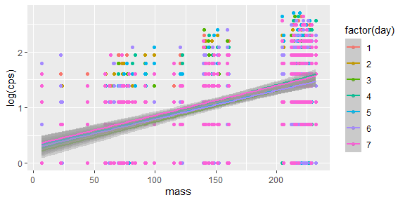

Plot log(CPS) @ m/z with estimated trend by burn.

``` r
df_hno3 %>%
  filter(cps > 0) %>%
  ggplot(aes(x = mass, y = log(cps), color = factor(burn))) +
  geom_point() +
  stat_smooth(method = "lm") +
  xlab("mass") +
  ylab("log(cps)")
```

    ## `geom_smooth()` using formula = 'y ~ x'

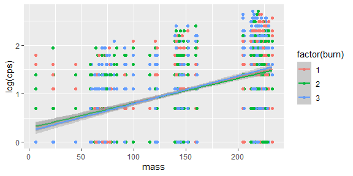

Plot log(CPS) @ m/z with estimated trend by day and sample order.

``` r
df_hno3 %>%
  filter(cps > 0) %>%
  ggplot(aes(x = mass, y = log(cps), color = factor(sample_order))) +
  geom_point() +
  stat_smooth(method = "lm") +
  facet_wrap(~day) +
  xlab("mass") +
  ylab("log(cps)")
```

    ## `geom_smooth()` using formula = 'y ~ x'

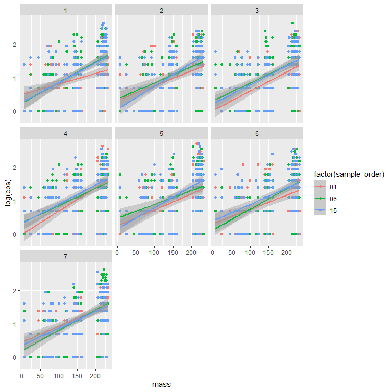

Plot log(CPS) @ m/z with estimated trend by sample order, day, and burn.

``` r
df_hno3 %>%
  filter(cps > 0) %>%
  ggplot(aes(x = mass, y = log(cps), color = factor(sample_order))) +
  geom_point() +
  stat_smooth(method = "lm") +
  facet_wrap(~ day + burn, ncol = 3) +
  xlab("mass") +
  ylab("log(cps)")
```

    ## `geom_smooth()` using formula = 'y ~ x'

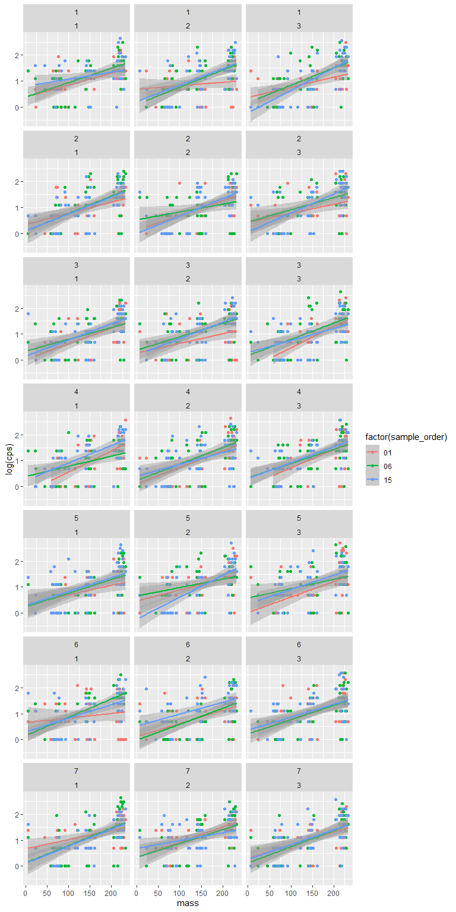

# 3 Model fitting

## 3.1 Model 1

A hierarchical/multilevel model with a Poisson likelihood for observed
CPS (level-1) modeled as a function of nested random effects for
individual burns (level-2) within HNO3 samples (level-3, i.e.,
“description”) within days (level-4).

``` r
bf_mod1 <- bf(cps ~ 1 +
                mass +
                (1 | day) +
                (1 | day:description) + 
                (1 | day:description:burn),
              family = poisson())

priors1 <- c(
  prior(normal(0, 3), class = "Intercept"),
  prior(normal(0, 0.1), class = "b"),
  prior(exponential(1), class = "sd")
  )

hno3_mod1 <- brm(bf_mod1,
                data = df_hno3,
                prior = priors1,
                #control = list(adapt_delta = 0.99, max_treedepth = 14),
                #sample_prior = "only",
                save_pars = save_pars(all = TRUE),
                seed = 145,
                chains=4, 
                iter=2000, 
                cores=4)

save(hno3_mod1, file = "C:/Users/rmartin/OneDrive - Environmental Protection Agency (EPA)/Documents/ICPMS_methods/ICPMS_7d_Expt/model_files/hno3_mod1.rda")
```

``` r
print(hno3_mod1, digits = 3, priors = TRUE)
```

    ##  Family: poisson 
    ##   Links: mu = log 
    ## Formula: cps ~ 1 + mass + (1 | day) + (1 | day:description) + (1 | day:description:burn) 
    ##    Data: df_hno3 (Number of observations: 3780) 
    ##   Draws: 4 chains, each with iter = 2000; warmup = 1000; thin = 1;
    ##          total post-warmup draws = 4000
    ## 
    ## Priors:
    ## b ~ normal(0, 0.1)
    ## Intercept ~ normal(0, 3)
    ## <lower=0> sd ~ exponential(1)
    ## 
    ## Multilevel Hyperparameters:
    ## ~day (Number of levels: 7) 
    ##               Estimate Est.Error l-95% CI u-95% CI  Rhat Bulk_ESS Tail_ESS
    ## sd(Intercept)    0.031     0.028    0.001    0.106 1.002     1318     2154
    ## 
    ## ~day:description (Number of levels: 21) 
    ##               Estimate Est.Error l-95% CI u-95% CI  Rhat Bulk_ESS Tail_ESS
    ## sd(Intercept)    0.099     0.022    0.061    0.148 1.000     1645     2514
    ## 
    ## ~day:description:burn (Number of levels: 63) 
    ##               Estimate Est.Error l-95% CI u-95% CI  Rhat Bulk_ESS Tail_ESS
    ## sd(Intercept)    0.042     0.019    0.005    0.080 1.002     1059     1748
    ## 
    ## Regression Coefficients:
    ##           Estimate Est.Error l-95% CI u-95% CI  Rhat Bulk_ESS Tail_ESS
    ## Intercept   -0.169     0.040   -0.249   -0.095 1.000     2715     2933
    ## mass         0.008     0.000    0.008    0.008 1.000     3840     2824
    ## 
    ## Draws were sampled using sampling(NUTS). For each parameter, Bulk_ESS
    ## and Tail_ESS are effective sample size measures, and Rhat is the potential
    ## scale reduction factor on split chains (at convergence, Rhat = 1).

Check observed counts
()
vs. average of posterior predictive distribution of counts
()

``` r
pp_check(hno3_mod1, type = "bars", ndraws = 400)
```

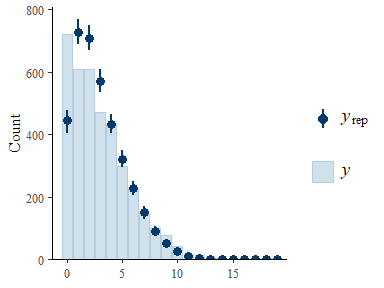

Check observed proportion of zeros in the dataset
()
vs. predicted proportion of zeros in replicated datasets
(,
i.e., posterior predictive distribution of zeros).

``` r
prop_zero <- function(x) mean(x == 0)

pp_check(hno3_mod1, type = "stat", stat = prop_zero)
```

    ## Using all posterior draws for ppc type 'stat' by default.

    ## `stat_bin()` using `bins = 30`. Pick better value with `binwidth`.

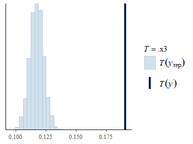

## 3.2 Model 2

A hierarchical model with a negative binomial likelihood.

``` r
bf_mod2 <- bf(cps ~ 1 + 
               mass +
               (1 | day) + 
               (1 | day:description) + 
               (1 | day:description:burn),
             family = negbinomial())

priors2 <- c(
  prior(normal(0, 3), class = "Intercept"),
  prior(normal(0, 0.1), class = "b"),
  prior(exponential(1), class = "sd"),
  prior(gamma(0.01, 0.01), "shape")
  )

hno3_mod2 <- brm(bf_mod2,
                data = df_hno3,
                prior = priors2,
                #control = list(adapt_delta = 0.99, max_treedepth = 14),
                #sample_prior = "only",
                save_pars = save_pars(all = TRUE),
                seed = 546,
                chains=4, 
                iter=2000, 
                cores=4)

save(hno3_mod2, file = "C:/Users/rmartin/OneDrive - Environmental Protection Agency (EPA)/Documents/ICPMS_methods/ICPMS_7d_Expt/model_files/hno3_mod2.rda")
```

``` r
print(hno3_mod2, digits = 3, priors = TRUE)
```

    ##  Family: negbinomial 
    ##   Links: mu = log; shape = identity 
    ## Formula: cps ~ 1 + mass + (1 | day) + (1 | day:description) + (1 | day:description:burn) 
    ##    Data: df_hno3 (Number of observations: 3780) 
    ##   Draws: 4 chains, each with iter = 2000; warmup = 1000; thin = 1;
    ##          total post-warmup draws = 4000
    ## 
    ## Priors:
    ## b ~ normal(0, 0.1)
    ## Intercept ~ normal(0, 3)
    ## <lower=0> sd ~ exponential(1)
    ## <lower=0> shape ~ gamma(0.01, 0.01)
    ## 
    ## Multilevel Hyperparameters:
    ## ~day (Number of levels: 7) 
    ##               Estimate Est.Error l-95% CI u-95% CI  Rhat Bulk_ESS Tail_ESS
    ## sd(Intercept)    0.032     0.028    0.001    0.104 1.003     1095     1630
    ## 
    ## ~day:description (Number of levels: 21) 
    ##               Estimate Est.Error l-95% CI u-95% CI  Rhat Bulk_ESS Tail_ESS
    ## sd(Intercept)    0.098     0.024    0.059    0.153 1.000     1463     2230
    ## 
    ## ~day:description:burn (Number of levels: 63) 
    ##               Estimate Est.Error l-95% CI u-95% CI  Rhat Bulk_ESS Tail_ESS
    ## sd(Intercept)    0.023     0.017    0.001    0.063 1.006     1283     1185
    ## 
    ## Regression Coefficients:
    ##           Estimate Est.Error l-95% CI u-95% CI  Rhat Bulk_ESS Tail_ESS
    ## Intercept   -0.164     0.042   -0.247   -0.080 1.001     1831     2448
    ## mass         0.008     0.000    0.008    0.008 1.000     4277     3017
    ## 
    ## Further Distributional Parameters:
    ##       Estimate Est.Error l-95% CI u-95% CI  Rhat Bulk_ESS Tail_ESS
    ## shape    5.444     0.401    4.743    6.286 1.001     5013     3026
    ## 
    ## Draws were sampled using sampling(NUTS). For each parameter, Bulk_ESS
    ## and Tail_ESS are effective sample size measures, and Rhat is the potential
    ## scale reduction factor on split chains (at convergence, Rhat = 1).

``` r
pp_check(hno3_mod2, type = "bars", ndraws = 400)
```

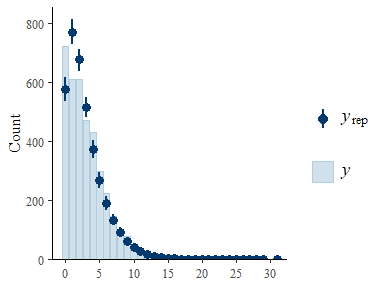

``` r
prop_zero <- function(x) mean(x == 0)

pp_check(hno3_mod2, type = "stat", stat = prop_zero)
```

    ## Using all posterior draws for ppc type 'stat' by default.

    ## `stat_bin()` using `bins = 30`. Pick better value with `binwidth`.

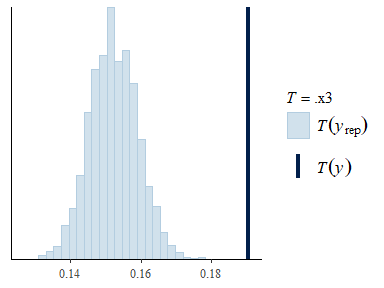

## 3.3 Model 3

A hierarchical model with a zero-inflated negative binomial likelihood.

``` r
bf_mod3 <- bf(cps ~ 1 + 
               mass +
               (1 | day) + 
               (1 | day:description) + 
               (1 | day:description:burn),
             family = zero_inflated_negbinomial())

priors3 <- c(
  prior(normal(0, 3), class = "Intercept"),
  prior(normal(0, 0.1), class = "b"),
  prior(exponential(1), class = "sd"),
  prior(gamma(0.01, 0.01), "shape"),
  prior(beta(1, 1), "zi")
  )

hno3_mod3 <- brm(bf_mod3,
                data = df_hno3,
                prior = priors3,
                #control = list(adapt_delta = 0.99, max_treedepth = 14),
                #sample_prior = "only",
                save_pars = save_pars(all = TRUE),
                seed = 65132,
                chains=4, 
                iter=2000, 
                cores=4)

save(hno3_mod3, file = "C:/Users/rmartin/OneDrive - Environmental Protection Agency (EPA)/Documents/ICPMS_methods/ICPMS_7d_Expt/model_files/hno3_mod3.rda")
```

``` r
print(hno3_mod3, digits = 3, priors = TRUE)
```

    ##  Family: zero_inflated_negbinomial 
    ##   Links: mu = log; shape = identity; zi = identity 
    ## Formula: cps ~ 1 + mass + (1 | day) + (1 | day:description) + (1 | day:description:burn) 
    ##    Data: df_hno3 (Number of observations: 3780) 
    ##   Draws: 4 chains, each with iter = 2000; warmup = 1000; thin = 1;
    ##          total post-warmup draws = 4000
    ## 
    ## Priors:
    ## b ~ normal(0, 0.1)
    ## Intercept ~ normal(0, 3)
    ## <lower=0> sd ~ exponential(1)
    ## <lower=0> shape ~ gamma(0.01, 0.01)
    ## <lower=0,upper=1> zi ~ beta(1, 1)
    ## 
    ## Multilevel Hyperparameters:
    ## ~day (Number of levels: 7) 
    ##               Estimate Est.Error l-95% CI u-95% CI  Rhat Bulk_ESS Tail_ESS
    ## sd(Intercept)    0.032     0.030    0.001    0.111 1.005     1035     1755
    ## 
    ## ~day:description (Number of levels: 21) 
    ##               Estimate Est.Error l-95% CI u-95% CI  Rhat Bulk_ESS Tail_ESS
    ## sd(Intercept)    0.095     0.024    0.054    0.149 1.003     1066     1529
    ## 
    ## ~day:description:burn (Number of levels: 63) 
    ##               Estimate Est.Error l-95% CI u-95% CI  Rhat Bulk_ESS Tail_ESS
    ## sd(Intercept)    0.023     0.017    0.001    0.063 1.005     1022     1618
    ## 
    ## Regression Coefficients:
    ##           Estimate Est.Error l-95% CI u-95% CI  Rhat Bulk_ESS Tail_ESS
    ## Intercept   -0.119     0.045   -0.207   -0.031 1.001     1913     2452
    ## mass         0.008     0.000    0.008    0.008 1.000     4005     3023
    ## 
    ## Further Distributional Parameters:
    ##       Estimate Est.Error l-95% CI u-95% CI  Rhat Bulk_ESS Tail_ESS
    ## shape    6.760     0.650    5.606    8.134 1.000     3638     3032
    ## zi       0.026     0.007    0.013    0.041 1.001     3640     2310
    ## 
    ## Draws were sampled using sampling(NUTS). For each parameter, Bulk_ESS
    ## and Tail_ESS are effective sample size measures, and Rhat is the potential
    ## scale reduction factor on split chains (at convergence, Rhat = 1).

``` r
pp_check(hno3_mod3, type = "bars", ndraws = 400)
```

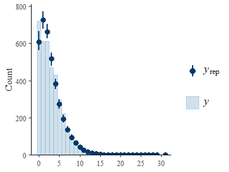

``` r
prop_zero <- function(x) mean(x == 0)

pp_check(hno3_mod3, type = "stat", stat = prop_zero)
```

    ## Using all posterior draws for ppc type 'stat' by default.

    ## `stat_bin()` using `bins = 30`. Pick better value with `binwidth`.

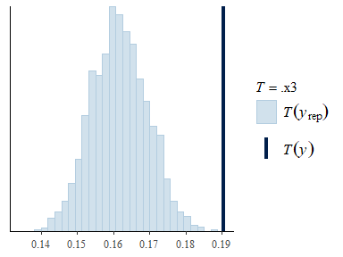

## 3.4 Model 4

A hierarchical model with a negative binomial likelihood and allowing
the m/z effect to vary according to groupings.

``` r
bf_mod4 <- bf(cps ~ 1 + 
               mass +
               (mass | day) + 
               (mass | day:description) + 
               (mass | day:description:burn),
             family = zero_inflated_negbinomial())

priors4 <- c(
  prior(normal(0, 3), class = "Intercept"),
  prior(normal(0, 0.1), class = "b"),
  prior(exponential(1), class = "sd"),
  prior(beta(1, 1), "zi")
  )

hno3_mod4 <- brm(bf_mod4,
                data = df_hno3,
                prior = priors4,
                #control = list(adapt_delta = 0.99, max_treedepth = 14),
                #sample_prior = "only",
                save_pars = save_pars(all = TRUE),
                seed = 3256,
                chains=4, 
                iter=2000, 
                cores=4)

save(hno3_mod4, file = "C:/Users/rmartin/OneDrive - Environmental Protection Agency (EPA)/Documents/ICPMS_methods/ICPMS_7d_Expt/model_files/hno3_mod4.rda")
```

``` r
print(hno3_mod4, digits = 3, priors = TRUE)
```

    ## Warning: There were 1 divergent transitions after warmup. Increasing
    ## adapt_delta above 0.8 may help. See
    ## http://mc-stan.org/misc/warnings.html#divergent-transitions-after-warmup

    ##  Family: zero_inflated_negbinomial 
    ##   Links: mu = log; shape = identity; zi = identity 
    ## Formula: cps ~ 1 + mass + (mass | day) + (mass | day:description) + (mass | day:description:burn) 
    ##    Data: df_hno3 (Number of observations: 3780) 
    ##   Draws: 4 chains, each with iter = 2000; warmup = 1000; thin = 1;
    ##          total post-warmup draws = 4000
    ## 
    ## Priors:
    ## b ~ normal(0, 0.1)
    ## Intercept ~ normal(0, 3)
    ## L ~ lkj_corr_cholesky(1)
    ## <lower=0> sd ~ exponential(1)
    ## <lower=0> shape ~ gamma(0.01, 0.01)
    ## <lower=0,upper=1> zi ~ beta(1, 1)
    ## 
    ## Multilevel Hyperparameters:
    ## ~day (Number of levels: 7) 
    ##                     Estimate Est.Error l-95% CI u-95% CI  Rhat Bulk_ESS
    ## sd(Intercept)          0.042     0.040    0.001    0.143 1.000     1407
    ## sd(mass)               0.000     0.000    0.000    0.001 1.002     1330
    ## cor(Intercept,mass)   -0.194     0.572   -0.976    0.923 1.002     2996
    ##                     Tail_ESS
    ## sd(Intercept)           1505
    ## sd(mass)                1290
    ## cor(Intercept,mass)     2353
    ## 
    ## ~day:description (Number of levels: 21) 
    ##                     Estimate Est.Error l-95% CI u-95% CI  Rhat Bulk_ESS
    ## sd(Intercept)          0.138     0.052    0.054    0.254 1.001     1031
    ## sd(mass)               0.000     0.000    0.000    0.001 1.006      598
    ## cor(Intercept,mass)   -0.540     0.472   -0.981    0.790 1.004     1337
    ##                     Tail_ESS
    ## sd(Intercept)           1525
    ## sd(mass)                1183
    ## cor(Intercept,mass)     1504
    ## 
    ## ~day:description:burn (Number of levels: 63) 
    ##                     Estimate Est.Error l-95% CI u-95% CI  Rhat Bulk_ESS
    ## sd(Intercept)          0.041     0.040    0.001    0.153 1.003     1003
    ## sd(mass)               0.000     0.000    0.000    0.001 1.006      659
    ## cor(Intercept,mass)   -0.383     0.572   -0.993    0.871 1.002     1175
    ##                     Tail_ESS
    ## sd(Intercept)           1014
    ## sd(mass)                1337
    ## cor(Intercept,mass)     2121
    ## 
    ## Regression Coefficients:
    ##           Estimate Est.Error l-95% CI u-95% CI  Rhat Bulk_ESS Tail_ESS
    ## Intercept   -0.124     0.054   -0.231   -0.021 1.002     2619     2913
    ## mass         0.008     0.000    0.007    0.008 1.002     3522     3423
    ## 
    ## Further Distributional Parameters:
    ##       Estimate Est.Error l-95% CI u-95% CI  Rhat Bulk_ESS Tail_ESS
    ## shape    6.805     0.679    5.641    8.251 1.001     4200     3021
    ## zi       0.026     0.007    0.013    0.041 1.000     3761     2238
    ## 
    ## Draws were sampled using sampling(NUTS). For each parameter, Bulk_ESS
    ## and Tail_ESS are effective sample size measures, and Rhat is the potential
    ## scale reduction factor on split chains (at convergence, Rhat = 1).

``` r
pp_check(hno3_mod4, type = "bars", ndraws = 400)
```

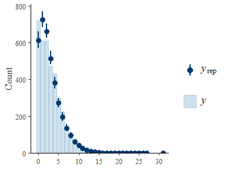

``` r
prop_zero <- function(x) mean(x == 0)

pp_check(hno3_mod4, type = "stat", stat = prop_zero)
```

    ## Using all posterior draws for ppc type 'stat' by default.

    ## `stat_bin()` using `bins = 30`. Pick better value with `binwidth`.

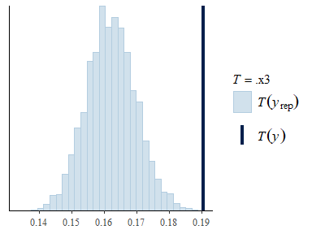

## 3.5 Model 5

A hierarchical model with a zero-inflated negative binomial likelihood
and modeling the distributional term (shape =
)
as a function of m/z.

``` r
bf_mod5 <- bf(cps ~ 1 + 
               mass +
               (1 | day) + 
               (1 | day:description) + 
               (1 | day:description:burn),
             family = zero_inflated_negbinomial(),
             shape ~ mass)

priors5 <- c(
  prior(normal(0, 3), class = "Intercept"),
  prior(normal(0, 0.1), class = "b"),
  prior(exponential(1), class = "sd"),
  prior(normal(0, 2), class = "Intercept", dpar = "shape"),
  prior(normal(0, 0.02), class = "b", dpar = "shape"),
  prior(beta(1, 1), "zi")
  )

hno3_mod5 <- brm(bf_mod5,
                data = df_hno3,
                prior = priors5,
                #control = list(adapt_delta = 0.99, max_treedepth = 14),
                #sample_prior = "only",
                save_pars = save_pars(all = TRUE),
                seed = 56112,
                chains=4, 
                iter=2000, 
                cores=4)

save(hno3_mod5, file = "C:/Users/rmartin/OneDrive - Environmental Protection Agency (EPA)/Documents/ICPMS_methods/ICPMS_7d_Expt/model_files/hno3_mod5.rda")
```

``` r
print(hno3_mod5, digits = 3, priors = TRUE)
```

    ##  Family: zero_inflated_negbinomial 
    ##   Links: mu = log; shape = log; zi = identity 
    ## Formula: cps ~ 1 + mass + (1 | day) + (1 | day:description) + (1 | day:description:burn) 
    ##          shape ~ mass
    ##    Data: df_hno3 (Number of observations: 3780) 
    ##   Draws: 4 chains, each with iter = 2000; warmup = 1000; thin = 1;
    ##          total post-warmup draws = 4000
    ## 
    ## Priors:
    ## b ~ normal(0, 0.1)
    ## b_shape ~ normal(0, 0.02)
    ## Intercept ~ normal(0, 3)
    ## Intercept_shape ~ normal(0, 2)
    ## <lower=0> sd ~ exponential(1)
    ## <lower=0,upper=1> zi ~ beta(1, 1)
    ## 
    ## Multilevel Hyperparameters:
    ## ~day (Number of levels: 7) 
    ##               Estimate Est.Error l-95% CI u-95% CI  Rhat Bulk_ESS Tail_ESS
    ## sd(Intercept)    0.032     0.029    0.001    0.106 1.004      950     1538
    ## 
    ## ~day:description (Number of levels: 21) 
    ##               Estimate Est.Error l-95% CI u-95% CI  Rhat Bulk_ESS Tail_ESS
    ## sd(Intercept)    0.091     0.023    0.053    0.142 1.002     1304     2000
    ## 
    ## ~day:description:burn (Number of levels: 63) 
    ##               Estimate Est.Error l-95% CI u-95% CI  Rhat Bulk_ESS Tail_ESS
    ## sd(Intercept)    0.024     0.017    0.001    0.065 1.004     1022     1582
    ## 
    ## Regression Coefficients:
    ##                 Estimate Est.Error l-95% CI u-95% CI  Rhat Bulk_ESS Tail_ESS
    ## Intercept         -0.152     0.046   -0.243   -0.065 1.001     2343     2370
    ## shape_Intercept   -0.057     0.148   -0.335    0.246 1.001     3560     2456
    ## mass               0.008     0.000    0.008    0.008 1.002     4018     2803
    ## shape_mass         0.011     0.001    0.009    0.014 1.000     3702     2402
    ## 
    ## Further Distributional Parameters:
    ##    Estimate Est.Error l-95% CI u-95% CI  Rhat Bulk_ESS Tail_ESS
    ## zi    0.017     0.005    0.007    0.028 1.000     3155     1707
    ## 
    ## Draws were sampled using sampling(NUTS). For each parameter, Bulk_ESS
    ## and Tail_ESS are effective sample size measures, and Rhat is the potential
    ## scale reduction factor on split chains (at convergence, Rhat = 1).

``` r
pp_check(hno3_mod5, type = "bars", ndraws = 400)
```

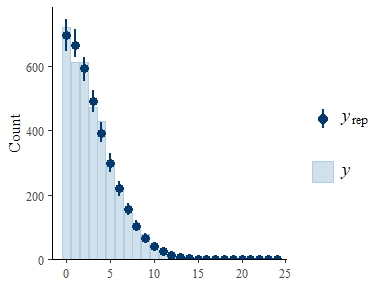

``` r
prop_zero <- function(x) mean(x == 0)

pp_check(hno3_mod5, type = "stat", stat = prop_zero)
```

    ## Using all posterior draws for ppc type 'stat' by default.

    ## `stat_bin()` using `bins = 30`. Pick better value with `binwidth`.

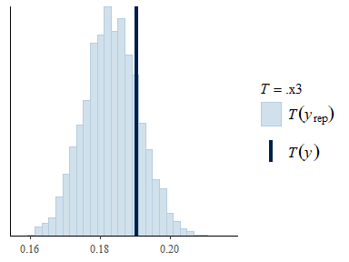

## 3.6 Model 6

A hierarchical model with a zero-inflated negative binomial likelihood
and modeling the distributional term (shape =
)
as a function of m/z. Also included a m/z effect on the zero inflation
term.

``` r
bf_mod6 <- bf(cps ~ 1 +
               mass +
               (1 | day) + 
               (1 | day:description) + 
               (1 | day:description:burn),
             family = zero_inflated_negbinomial(),
             shape ~ mass,
             zi ~ mass)

priors6 <- c(
  prior(normal(0, 3), class = "Intercept"),
  prior(normal(0, 0.1), class = "b"),
  prior(exponential(1), class = "sd"),
  prior(normal(0, 2), class = "Intercept", dpar = "shape"),
  prior(normal(0, 0.02), class = "b", dpar = "shape"),
  prior(normal(0, 5), class = "Intercept", dpar = "zi"),
  prior(normal(0, 3), class = "b", dpar = "zi")
  )

hno3_mod6 <- brm(bf_mod6,
                data = df_hno3,
                prior = priors6,
                #control = list(adapt_delta = 0.99, max_treedepth = 14),
                #sample_prior = "only",
                save_pars = save_pars(all = TRUE),
                seed = 3213,
                chains=4, 
                iter=3000, 
                cores=4)

save(hno3_mod6, file = "C:/Users/rmartin/OneDrive - Environmental Protection Agency (EPA)/Documents/ICPMS_methods/ICPMS_7d_Expt/model_files/hno3_mod6.rda")
```

``` r
print(hno3_mod6, digits = 3, priors = TRUE)
```

    ##  Family: zero_inflated_negbinomial 
    ##   Links: mu = log; shape = log; zi = logit 
    ## Formula: cps ~ 1 + mass + (1 | day) + (1 | day:description) + (1 | day:description:burn) 
    ##          shape ~ mass
    ##          zi ~ mass
    ##    Data: df_hno3 (Number of observations: 3780) 
    ##   Draws: 4 chains, each with iter = 3000; warmup = 1500; thin = 1;
    ##          total post-warmup draws = 6000
    ## 
    ## Priors:
    ## b ~ normal(0, 0.1)
    ## b_shape ~ normal(0, 0.02)
    ## b_zi ~ normal(0, 3)
    ## Intercept ~ normal(0, 3)
    ## Intercept_shape ~ normal(0, 2)
    ## Intercept_zi ~ normal(0, 5)
    ## <lower=0> sd ~ exponential(1)
    ## 
    ## Multilevel Hyperparameters:
    ## ~day (Number of levels: 7) 
    ##               Estimate Est.Error l-95% CI u-95% CI  Rhat Bulk_ESS Tail_ESS
    ## sd(Intercept)    0.032     0.028    0.001    0.103 1.002     2374     3726
    ## 
    ## ~day:description (Number of levels: 21) 
    ##               Estimate Est.Error l-95% CI u-95% CI  Rhat Bulk_ESS Tail_ESS
    ## sd(Intercept)    0.091     0.023    0.053    0.142 1.002     2267     3205
    ## 
    ## ~day:description:burn (Number of levels: 63) 
    ##               Estimate Est.Error l-95% CI u-95% CI  Rhat Bulk_ESS Tail_ESS
    ## sd(Intercept)    0.023     0.017    0.001    0.063 1.002     2242     2978
    ## 
    ## Regression Coefficients:
    ##                 Estimate Est.Error l-95% CI u-95% CI  Rhat Bulk_ESS Tail_ESS
    ## Intercept         -0.073     0.066   -0.200    0.055 1.000     4047     3514
    ## shape_Intercept    0.281     0.271   -0.211    0.838 1.000     5677     3386
    ## zi_Intercept      -2.217     1.397   -6.051   -0.931 1.001     3263     1602
    ## mass               0.008     0.000    0.007    0.008 1.000     4871     3834
    ## shape_mass         0.010     0.001    0.007    0.013 1.001     6416     5680
    ## zi_mass           -0.009     0.006   -0.016    0.006 1.001     2929     1921
    ## 
    ## Draws were sampled using sampling(NUTS). For each parameter, Bulk_ESS
    ## and Tail_ESS are effective sample size measures, and Rhat is the potential
    ## scale reduction factor on split chains (at convergence, Rhat = 1).

``` r
pp_check(hno3_mod6, type = "bars", ndraws = 1000)
```

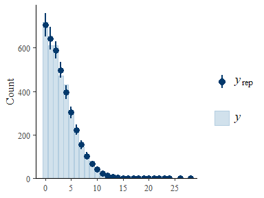

``` r
prop_zero <- function(x) mean(x == 0)

pp_check(hno3_mod6, type = "stat", stat = prop_zero)
```

    ## Using all posterior draws for ppc type 'stat' by default.

    ## `stat_bin()` using `bins = 30`. Pick better value with `binwidth`.

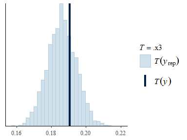

``` r
pp_check(hno3_mod6, type = "scatter_avg", ndraws = 200) 
```

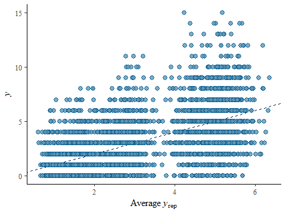

Plot the fitted intercept and slope parameters for the count component
of the model.

``` r
hno3_mod6 %>%
  gather_draws(b_mass) %>%
  ggplot(aes(y = .variable, x = .value)) +
  stat_halfeye() +
  xlab("") +
  ylab("") +
  ggtitle("Estimated effect of mass on count \n component of the model")
```

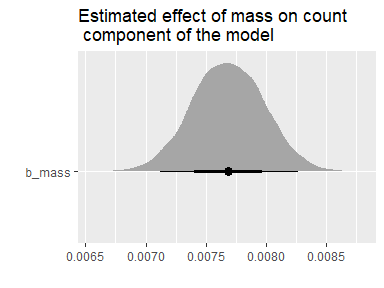

Plot the fitted intercept and slope parameters for the zero-inflation
component of the model.

``` r
hno3_mod6 %>%
  gather_draws(b_zi_mass) %>%
  ggplot(aes(y = .variable, x = .value)) +
  stat_halfeye() +
  geom_vline(xintercept = 0, linetype = "dashed") +
  xlab("") +
  ylab("") +
  ggtitle("Estimated effect of mass on \n zero-inflation component \n of the model")
```

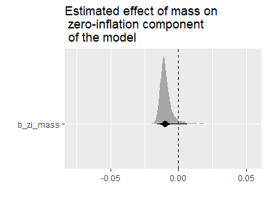

Plot the estimated effect of m/z on the shape paramete of the count
model.

``` r
hno3_mod6 %>%
  gather_draws(b_shape_mass) %>%
  ggplot(aes(y = .variable, x = .value)) +
  stat_halfeye() +
  xlab("") +
  ylab("") +
  ggtitle("Estimated effect of mass on \n shape component of \n the count model")
```

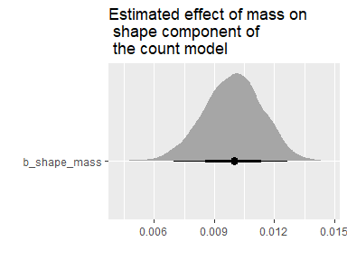

Plot the estimated scale parameters for the hierarchical effects.

``` r
hno3_mod6 %>%
  gather_draws(sd_day__Intercept, `sd_day:description__Intercept`, `sd_day:description:burn__Intercept`) %>%
  ggplot(aes(y = .variable, x = .value)) +
  stat_halfeye() +
  xlab("") +
  ylab("") +
  ggtitle("Estimated scale parameters \n for hierarchical effects")
```

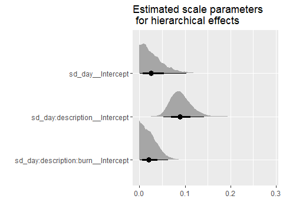

Plot the estimated hierarchical effects (as differences from the overall
mean) for sample replicates within days.

``` r
hno3_mod6 %>%
  gather_draws(`r_day:description`[label, ]) %>%
  ggplot(aes(y = label, x = .value)) +
  stat_pointinterval() +
  xlab("") +
  ylab("") +
  geom_vline(xintercept = 0, linetype = "dashed") +
  ggtitle("Estimated effects for sample replicates") 
```

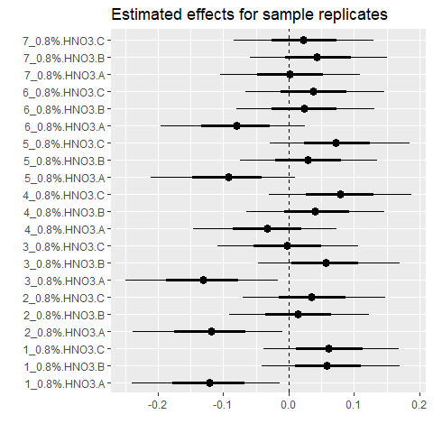

Plot the estimated hierarchical effects (centered over zero) for days 1
to 7.

``` r
hno3_mod6 %>%
  gather_draws(`r_day:description:burn`[day, ]) %>%
  ggplot(aes(y = day, x = .value)) +
  stat_pointinterval() +
  xlab("") +
  ylab("") +
  geom_vline(xintercept = 0, linetype = "dashed") +
  ggtitle("Estimated effects for burn replicates \n within samples across days") 
```

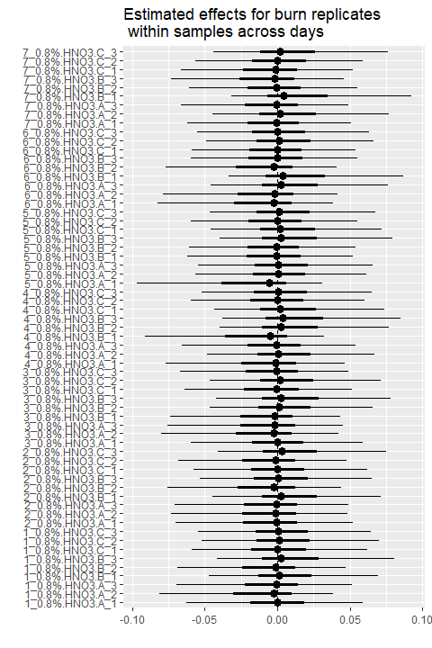

Plot conditional effect of m/z on cps

``` r
plot(conditional_effects(hno3_mod6), points = TRUE)
```

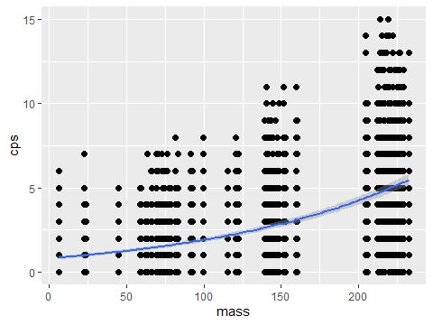

Plot the estimated conditional effect of m/z on the variation in counts
at the observation level (shape parameter). Note: as shape increases,
variation decreases.

``` r
plot(conditional_effects(hno3_mod6, dpar = "shape"))
```

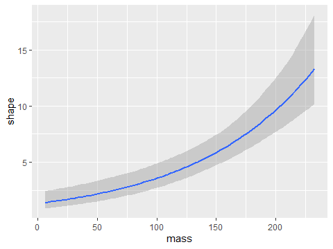

Plot the estimated conditional effect of m/z on the rate of zero’s
observed. Note: as

increases, the probability of a zero increases.

``` r
plot(conditional_effects(hno3_mod6, dpar = "zi"))
```

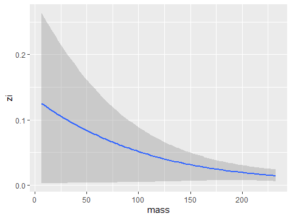

# 4 Compare models

Compare models 6 and 7 with loo.

``` r
loo5 <- brms::loo(hno3_mod5)
loo6 <- brms::loo(hno3_mod6)

loo_compare_5_6 <- brms::loo_compare(loo5, loo6)
```

``` r
print(loo_compare_5_6)
```

    ##           elpd_diff se_diff
    ## hno3_mod6  0.0       0.0   
    ## hno3_mod5 -1.7       1.5

# 5 Predict to mass

Make a data frame with hypothetical mass, day, burn, and sample type
(“descr”) to predict to

``` r
df_X <- tibble(mass = seq(6, 249, 0.5), day = 8, burn = 1, description = "HNO3")
print(df_X)
```

    ## # A tibble: 487 × 4
    ##     mass   day  burn description
    ##    <dbl> <dbl> <dbl> <chr>      
    ##  1   6       8     1 HNO3       
    ##  2   6.5     8     1 HNO3       
    ##  3   7       8     1 HNO3       
    ##  4   7.5     8     1 HNO3       
    ##  5   8       8     1 HNO3       
    ##  6   8.5     8     1 HNO3       
    ##  7   9       8     1 HNO3       
    ##  8   9.5     8     1 HNO3       
    ##  9  10       8     1 HNO3       
    ## 10  10.5     8     1 HNO3       
    ## # ℹ 477 more rows

``` r
#save(df_X, file = "C:/Users/rmartin/OneDrive - Environmental Protection Agency (EPA)/Documents/ICPMS_methods/ICPMS_7d_Expt/model_files/df_X.rda")
```

Predict to the hypothetical data.

``` r
pred_X <- df_X %>%
  add_predicted_draws(hno3_mod6, allow_new_levels = TRUE)

print(pred_X)
```

    ## # A tibble: 2,922,000 × 9
    ## # Groups:   mass, day, burn, description, .row [487]
    ##     mass   day  burn description  .row .chain .iteration .draw .prediction
    ##    <dbl> <dbl> <dbl> <chr>       <int>  <int>      <int> <int>       <dbl>
    ##  1     6     8     1 HNO3            1     NA         NA     1           0
    ##  2     6     8     1 HNO3            1     NA         NA     2           0
    ##  3     6     8     1 HNO3            1     NA         NA     3           0
    ##  4     6     8     1 HNO3            1     NA         NA     4           2
    ##  5     6     8     1 HNO3            1     NA         NA     5           0
    ##  6     6     8     1 HNO3            1     NA         NA     6           1
    ##  7     6     8     1 HNO3            1     NA         NA     7           0
    ##  8     6     8     1 HNO3            1     NA         NA     8           1
    ##  9     6     8     1 HNO3            1     NA         NA     9           0
    ## 10     6     8     1 HNO3            1     NA         NA    10           2
    ## # ℹ 2,921,990 more rows

``` r
#save(pred_X, file = "C:/Users/rmartin/OneDrive - Environmental Protection Agency (EPA)/Documents/ICPMS_methods/ICPMS_7d_Expt/model_files/pred_X.rda")
```

Summarize the cps predictions (median, quantiles) by m/z.

``` r
pred_X %>%
  group_by(mass) %>%
  median_qi(.prediction) %>%
  select(mass, .prediction, .lower, .upper) %>%
  rename(posterior_median = .prediction,
         lower_95_CI = .lower,
         upper_95_CI = .upper)
```

    ## # A tibble: 487 × 4
    ##     mass posterior_median lower_95_CI upper_95_CI
    ##    <dbl>            <dbl>       <dbl>       <dbl>
    ##  1   6                  0           0           4
    ##  2   6.5                0           0           4
    ##  3   7                  0           0           4
    ##  4   7.5                0           0           4
    ##  5   8                  0           0           4
    ##  6   8.5                0           0           4
    ##  7   9                  0           0           4
    ##  8   9.5                0           0           4
    ##  9  10                  0           0           4
    ## 10  10.5                0           0           4
    ## # ℹ 477 more rows

Plot the predictions and data used to fit the Ideal Background model.

``` r
pred_X %>%
  ggplot(aes(x = mass, y = .prediction)) +
  stat_lineribbon(.width = c(0.99, 0.75, 0.5)) + 
  scale_fill_brewer(palette = "YlOrRd") +
  geom_point(data = df_hno3, aes(x = mass, y = cps)) +
  ylab("CPS") +
  xlab("mass") +
  ggtitle("Predicted Ideal Background and \n Observed CPS @ m/z in HNO3 0.8%") +
  scale_y_continuous(minor_breaks = seq(0, 20, 1)) +
  theme_pubr() +
  theme(legend.position = "right", legend.direction = "vertical")
```

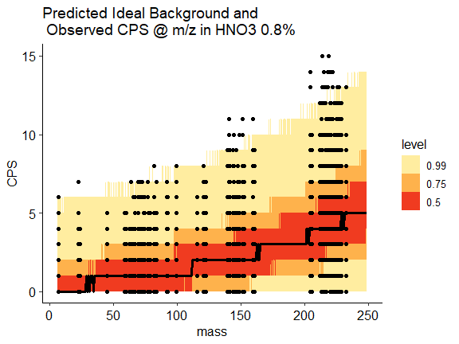

Export and xlsx file with the above predictions.

``` r
pred_X %>%
  group_by(mass) %>%
  median_qi(.prediction, .width = 0.99) %>%
  select(mass, .prediction, .lower, .upper) %>%
  rename(posterior_median = .prediction,
         lower_99_CI = .lower,
         upper_99_CI = .upper) %>%
  write_csv(file = "prediction_interval_summary.csv")
```

Plot prediction of ideal background noise vs. analyte observations in
HNO3 0.8%.

``` r
pred_X %>%
  ggplot(aes(x = mass, y = .prediction)) +
  stat_lineribbon(.width = c(0.99, 0.75, 0.5)) + 
  scale_fill_brewer(palette = "YlOrRd") +
  geom_point(data = df_analyte, aes(x = mass, y = cps), shape = 1) +
  geom_point(data = df_hno3, aes(x = mass, y = cps)) +
  ylab("CPS") +
  xlab("mass") +
  ggtitle("Analyte CPS and Predicted Ideal Background CPS @ m/z \n in HNO3 0.8% (note y-axis truncated to preserve \n scale at lower CPS)") +
  theme_pubr() +
  theme(legend.position = "right", legend.direction = "vertical") +
  ylim(0, 75)
```

    ## Warning: Removed 200 rows containing missing values or values outside the scale range
    ## (`geom_point()`).


Plot prediction of ideal background noise vs. interference m/z in daily
solution.

``` r
pred_X %>%
  ggplot(aes(x = mass, y = .prediction)) +
  stat_lineribbon(.width = c(0.99, 0.75, 0.5)) + 
  scale_fill_brewer(palette = "YlOrRd") +
  geom_point(data = df_daily, aes(x = mass, y = cps, color = factor(mass))) +
  ylab("CPS") +
  xlab("mass") +
  ggtitle("Observed Daily Solution CPS @ m/z \n and Predicted Ideal Background CPS") +
  theme_pubr() +
  theme(legend.position = "right", legend.direction = "vertical") +
  ylim(0, 100)
```

    ## Warning: Removed 43 rows containing missing values or values outside the scale range
    ## (`geom_point()`).

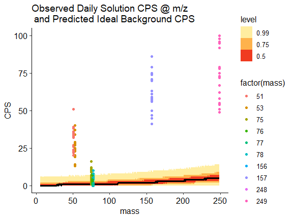

# 6 Predict avg of 3 burns at m/z

Make a data frame again, but this time with 3 burns, in order to take
their average.

``` r
df_X_avg <- tibble(expand.grid(mass = seq(6, 249, 0.5), day = 8, burn = 1:3, description = "HNO3"))
print(df_X_avg)
```

    ## # A tibble: 1,461 × 4
    ##     mass   day  burn description
    ##    <dbl> <dbl> <int> <fct>      
    ##  1   6       8     1 HNO3       
    ##  2   6.5     8     1 HNO3       
    ##  3   7       8     1 HNO3       
    ##  4   7.5     8     1 HNO3       
    ##  5   8       8     1 HNO3       
    ##  6   8.5     8     1 HNO3       
    ##  7   9       8     1 HNO3       
    ##  8   9.5     8     1 HNO3       
    ##  9  10       8     1 HNO3       
    ## 10  10.5     8     1 HNO3       
    ## # ℹ 1,451 more rows

``` r
#save(df_X_avg, file = "C:/Users/rmartin/OneDrive - Environmental Protection Agency (EPA)/Documents/ICPMS_methods/ICPMS_7d_Expt/model_files/df_X_avg.rda")
```

Predict to the hypothetical data.

``` r
pred_X_avg <- df_X_avg %>%
  add_predicted_draws(hno3_mod6, allow_new_levels = TRUE) %>%
  group_by(mass, .draw) %>%
  summarize(avg_CPS = mean(.prediction))
```

    ## `summarise()` has grouped output by 'mass'. You can override using the
    ## `.groups` argument.

``` r
print(pred_X_avg)
```

    ## # A tibble: 2,922,000 × 3
    ## # Groups:   mass [487]
    ##     mass .draw avg_CPS
    ##    <dbl> <int>   <dbl>
    ##  1     6     1   0.333
    ##  2     6     2   2    
    ##  3     6     3   1    
    ##  4     6     4   1    
    ##  5     6     5   0.667
    ##  6     6     6   1.33 
    ##  7     6     7   1.33 
    ##  8     6     8   1    
    ##  9     6     9   0.333
    ## 10     6    10   0    
    ## # ℹ 2,921,990 more rows

``` r
#save(pred_X_avg, file = "C:/Users/rmartin/OneDrive - Environmental Protection Agency (EPA)/Documents/ICPMS_methods/ICPMS_7d_Expt/model_files/pred_X_avg.rda")
```

Export an xlsx file summarizing the above average CPS predictions across
m/z.

``` r
pred_X_avg %>%
  group_by(mass) %>%
  median_qi(avg_CPS, .width = 0.99) %>%
  select(mass, avg_CPS, .lower, .upper) %>%
  rename(posterior_median = avg_CPS,
         lower_99_CI = .lower,
         upper_99_CI = .upper) %>%
  write_csv(file = "prediction_avg_cps_interval_summary.csv")
```

Now to compare to observed 1/2 masses, the analytes of interest for
interference, and the daily solution. All of these CPS must be averaged
over 3 burns as well.

``` r
df_hno3_avg <- df_hno3 %>%
  group_by(description, day, mass, sample_order) %>%
  mutate(description = "Ideal background") %>%
  summarise(avg_cps = mean(cps), .groups = "drop") 

#save(df_hno3_avg, file = "C:/Users/rmartin/OneDrive - Environmental Protection Agency (EPA)/Documents/ICPMS_methods/ICPMS_7d_Expt/model_files/df_hno3_avg.rda")

df_hno3_avg
```

    ## # A tibble: 1,260 × 5
    ##    description        day  mass sample_order avg_cps
    ##    <chr>            <dbl> <dbl> <chr>          <dbl>
    ##  1 Ideal background     1   6.5 01             2.67 
    ##  2 Ideal background     1   6.5 06             1.33 
    ##  3 Ideal background     1   6.5 15             1.67 
    ##  4 Ideal background     1  22.5 01             2    
    ##  5 Ideal background     1  22.5 06             1.33 
    ##  6 Ideal background     1  22.5 15             2.67 
    ##  7 Ideal background     1  23.5 01             2    
    ##  8 Ideal background     1  23.5 06             0.333
    ##  9 Ideal background     1  23.5 15             0    
    ## 10 Ideal background     1  44.5 01             0.333
    ## # ℹ 1,250 more rows

Create data frame of analyte m/z for averaged CPS.

``` r
df_analyte_avg <- df_cleaned %>%
  filter(description %in% c("0.8% HNO3 A", "0.8% HNO3 B", "0.8% HNO3 C"),
         mass %in% c(9, 27, 51, 52, 55, 59, 60, 63, 66, 75, 78, 98, 
                     107, 111, 123, 137, 143, 145, 147, 149, 150, 
                     155, 157, 205, 206, 232, 238)) %>%
  group_by(description, day, mass, sample_order) %>%
  mutate(description = "Analytes") %>%
  summarise(avg_cps = mean(cps), .groups = "drop")

#save(df_analyte_avg, file = "C:/Users/rmartin/OneDrive - Environmental Protection Agency (EPA)/Documents/ICPMS_methods/ICPMS_7d_Expt/model_files/df_analyte_avg.rda")

df_analyte_avg
```

    ## # A tibble: 567 × 5
    ##    description   day  mass sample_order avg_cps
    ##    <chr>       <dbl> <dbl> <chr>          <dbl>
    ##  1 Analytes        1     9 01             0.333
    ##  2 Analytes        1     9 06             3.33 
    ##  3 Analytes        1     9 15             1.33 
    ##  4 Analytes        1    27 01             2.33 
    ##  5 Analytes        1    27 06             2.33 
    ##  6 Analytes        1    27 15             4    
    ##  7 Analytes        1    51 01             7.33 
    ##  8 Analytes        1    51 06             9    
    ##  9 Analytes        1    51 15             7    
    ## 10 Analytes        1    52 01           111.   
    ## # ℹ 557 more rows

Create data frame of averaged CPS for daily solution m/z.

``` r
df_daily_avg <- df_cleaned %>%
  filter(description %in% c("Daily Solution New Na with 100ppb Er 5% HCL"),
         mass %in% c(51, 53, 75, 76, 77, 78, 156, 157, 248, 249)) %>%
  group_by(description, day, mass, sample_order) %>%
  mutate(description = "Daily solution") %>%
  summarise(avg_cps = mean(cps), .groups = "drop")

#save(df_daily_avg, file = "C:/Users/rmartin/OneDrive - Environmental Protection Agency (EPA)/Documents/ICPMS_methods/ICPMS_7d_Expt/model_files/df_daily_avg.rda")

df_daily_avg
```

    ## # A tibble: 70 × 5
    ##    description      day  mass sample_order avg_cps
    ##    <chr>          <dbl> <dbl> <chr>          <dbl>
    ##  1 Daily solution     1    51 04             30   
    ##  2 Daily solution     1    53 04             27   
    ##  3 Daily solution     1    75 04              4.33
    ##  4 Daily solution     1    76 04              5   
    ##  5 Daily solution     1    77 04              2.67
    ##  6 Daily solution     1    78 04              3.33
    ##  7 Daily solution     1   156 04            193   
    ##  8 Daily solution     1   157 04             60.3 
    ##  9 Daily solution     1   248 04            352.  
    ## 10 Daily solution     1   249 04             84.3 
    ## # ℹ 60 more rows

Combine all three averaged observed datasets: Ideal Background (HNO3
0.8%, analyte solutions, and daily solutions)

``` r
df_observed_avg <- bind_rows(df_hno3_avg, df_analyte_avg, df_daily_avg) %>%
  mutate(description = factor(description))

#save(df_observed_avg, file = "C:/Users/rmartin/OneDrive - Environmental Protection Agency (EPA)/Documents/ICPMS_methods/ICPMS_7d_Expt/model_files/df_observed_avg.rda")

df_observed_avg
```

    ## # A tibble: 1,897 × 5
    ##    description        day  mass sample_order avg_cps
    ##    <fct>            <dbl> <dbl> <chr>          <dbl>
    ##  1 Ideal background     1   6.5 01             2.67 
    ##  2 Ideal background     1   6.5 06             1.33 
    ##  3 Ideal background     1   6.5 15             1.67 
    ##  4 Ideal background     1  22.5 01             2    
    ##  5 Ideal background     1  22.5 06             1.33 
    ##  6 Ideal background     1  22.5 15             2.67 
    ##  7 Ideal background     1  23.5 01             2    
    ##  8 Ideal background     1  23.5 06             0.333
    ##  9 Ideal background     1  23.5 15             0    
    ## 10 Ideal background     1  44.5 01             0.333
    ## # ℹ 1,887 more rows

Summarize the cps predictions (median, quantiles) by m/z.

``` r
pred_X_avg %>%
  group_by(mass) %>%
  median_qi(avg_CPS, .width = 0.99) %>%
  select(mass, avg_CPS, .lower, .upper) %>%
  rename(posterior_median = avg_CPS,
         lower_99_CI = .lower,
         upper_99_CI = .upper)
```

    ## # A tibble: 487 × 4
    ##     mass posterior_median lower_99_CI upper_99_CI
    ##    <dbl>            <dbl>       <dbl>       <dbl>
    ##  1   6              0.667           0        3   
    ##  2   6.5            0.667           0        3.33
    ##  3   7              0.667           0        3.33
    ##  4   7.5            0.667           0        3.33
    ##  5   8              0.667           0        3   
    ##  6   8.5            0.667           0        3   
    ##  7   9              0.667           0        3   
    ##  8   9.5            0.667           0        3.33
    ##  9  10              0.667           0        3.33
    ## 10  10.5            0.667           0        3.33
    ## # ℹ 477 more rows

Plot the predictions.

``` r
pred_X_avg %>%
  ggplot(aes(x = mass, y = avg_CPS)) +
  stat_lineribbon(.width = c(0.99, 0.75, 0.5)) + 
  scale_fill_brewer(palette = "YlOrRd") +
  ylab("Average CPS") +
  xlab("Mass") +
  ggtitle("Predicted average CPS (3 burn replicates) @ m/z \n in HNO3 0.8% (Ideal Background)") +
  scale_y_continuous(minor_breaks = seq(0, 20, 1)) +
  theme_pubr() +
  theme(legend.position = "right", legend.direction = "vertical")
```

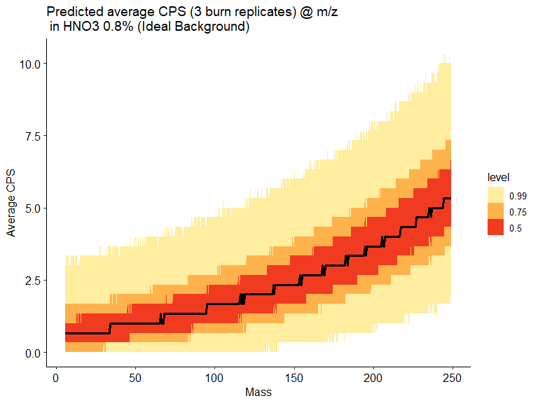

Plot the average predictions of CPS at m/z and the observed (average of
3 burns) data.

``` r
plot_ibg_obs <- 
pred_X_avg %>%
  ggplot(aes(x = mass, y = avg_CPS)) +
  stat_lineribbon(.width = c(0.99, 0.75, 0.5), alpha = 1) + 
  scale_fill_discrete_sequential(name = "Predicted response", palette = "Light Grays") +
  geom_point(data = df_observed_avg, aes(x = mass, y = avg_cps, 
                                         shape = description,
                                         color = description)) +
  ylab("CPS") +
  xlab("Mass") +
  ggtitle("Predicted average (3 burns) Ideal Background and observed average CPS @ m/z") +
  theme_pubr() +
  theme(legend.position = "right", legend.direction = "vertical") +
  scale_shape_manual(name = "Observed response", labels = c("Analyte mass", "0.8% HNO3 and 5% HCl", "Interference free mass"), values = c(8, 15, 1)) +
  #scale_color_manual(name = "Observed response", labels = c("Analyte mass", "0.8% HNO3 and 5% HCl", "Interference free mass"), values = c("orange", "skyblue", "black")) +
  scale_color_discrete_qualitative(name = "Observed response", labels = c("Analyte mass", "0.8% HNO3 and 5% HCl", "Interference free mass")
                     , palette = "Dark 3") +
  scale_y_continuous(limits = c(0, 40), minor_breaks = seq(0, 40, 5)) + 
  theme(legend.position = "right", legend.box = "vertical")

# ggsave only works in R console (i.e., copy + paste to save)
#ggsave(filename = "predicted_and_observed_cps.tif",
#       plot = plot_ibg_obs,
#       device = "tiff",
#       width = 210 / 25.4,
#       height = 180 / 25.4,
#       units = "in")

plot_ibg_obs
```

    ## Warning: Removed 129 rows containing missing values or values outside the scale range
    ## (`geom_point()`).

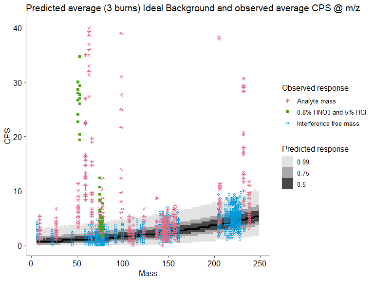

” In figure 3 (the above figure), the on-mass response for all method
analytes are graphed as pink stars. When these pink stars are found
within the gray shaded region, it means the blank response is
indistinguishable from the white noise levels of the instrument in that
mass range. The contamination-limited analytes are those analytes where
pink stars fall outside the gray shaded area. The practical mplication
is that every end user could generate a model and figure like this and
every analyte in the end user’s lab could be classified as noise limited
or contamination limited. This classification helps the end user (and
the software) to understand which analytes are likely to be poor
performers when it comes to on-mass IDL and the recovery of the MRL-LFB
spike.” – Wilson et al (unpublished technical guidance)

# 7 Session Information

``` r
sessionInfo()
```

    ## R version 4.4.1 (2024-06-14 ucrt)
    ## Platform: x86_64-w64-mingw32/x64
    ## Running under: Windows 11 x64 (build 22631)
    ## 
    ## Matrix products: default
    ## 
    ## 
    ## locale:
    ## [1] LC_COLLATE=English_United States.utf8 
    ## [2] LC_CTYPE=English_United States.utf8   
    ## [3] LC_MONETARY=English_United States.utf8
    ## [4] LC_NUMERIC=C                          
    ## [5] LC_TIME=English_United States.utf8    
    ## 
    ## time zone: America/New_York
    ## tzcode source: internal
    ## 
    ## attached base packages:
    ## [1] stats     graphics  grDevices datasets  utils     methods   base     
    ## 
    ## other attached packages:
    ##  [1] brms_2.22.0      Rcpp_1.0.14      colorspace_2.1-1 tidybayes_3.0.7 
    ##  [5] bayesplot_1.11.1 lubridate_1.9.4  forcats_1.0.0    stringr_1.5.1   
    ##  [9] dplyr_1.1.4      purrr_1.0.4      readr_2.1.5      tidyr_1.3.1     
    ## [13] tibble_3.2.1     tidyverse_2.0.0  itertools_0.1-3  iterators_1.0.14
    ## [17] foreach_1.5.2    future_1.34.0    ggrepel_0.9.6    kableExtra_1.4.0
    ## [21] gridExtra_2.3    ggExtra_0.10.1   moments_0.14.1   ggpubr_0.6.0    
    ## [25] ggplot2_3.5.1    readxl_1.4.5    
    ## 
    ## loaded via a namespace (and not attached):
    ##  [1] inline_0.3.21        rlang_1.1.5          magrittr_2.0.3      
    ##  [4] matrixStats_1.5.0    compiler_4.4.1       mgcv_1.9-1          
    ##  [7] loo_2.8.0            reshape2_1.4.4       systemfonts_1.2.1   
    ## [10] vctrs_0.6.5          pkgconfig_2.0.3      arrayhelpers_1.1-0  
    ## [13] fastmap_1.2.0        backports_1.5.0      labeling_0.4.3      
    ## [16] utf8_1.2.4           promises_1.3.2       rmarkdown_2.29      
    ## [19] tzdb_0.4.0           xfun_0.51            later_1.4.1         
    ## [22] broom_1.0.7          parallel_4.4.1       R6_2.6.1            
    ## [25] RColorBrewer_1.1-3   StanHeaders_2.32.10  stringi_1.8.4       
    ## [28] parallelly_1.42.0    car_3.1-3            cellranger_1.1.0    
    ## [31] rstan_2.32.6         knitr_1.49           splines_4.4.1       
    ## [34] httpuv_1.6.15        Matrix_1.7-0         timechange_0.3.0    
    ## [37] tidyselect_1.2.1     rstudioapi_0.17.1    abind_1.4-8         
    ## [40] yaml_2.3.10          codetools_0.2-20     miniUI_0.1.1.1      
    ## [43] pkgbuild_1.4.6       listenv_0.9.1        plyr_1.8.9          
    ## [46] lattice_0.22-6       shiny_1.10.0         withr_3.0.2         
    ## [49] bridgesampling_1.1-2 posterior_1.6.1      coda_0.19-4.1       
    ## [52] evaluate_1.0.3       RcppParallel_5.1.10  ggdist_3.3.2        
    ## [55] xml2_1.3.7           pillar_1.10.1        carData_3.0-5       
    ## [58] tensorA_0.36.2.1     checkmate_2.3.2      renv_1.1.2          
    ## [61] stats4_4.4.1         distributional_0.5.0 generics_0.1.3      
    ## [64] hms_1.1.3            rstantools_2.4.0     munsell_0.5.1       
    ## [67] scales_1.3.0         globals_0.16.3       xtable_1.8-4        
    ## [70] glue_1.8.0           tools_4.4.1          ggsignif_0.6.4      
    ## [73] mvtnorm_1.3-3        grid_4.4.1           QuickJSR_1.6.0      
    ## [76] nlme_3.1-164         Formula_1.2-5        cli_3.6.4           
    ## [79] svUnit_1.0.6         viridisLite_0.4.2    svglite_2.1.3       
    ## [82] Brobdingnag_1.2-9    gtable_0.3.6         rstatix_0.7.2       
    ## [85] digest_0.6.37        farver_2.1.2         htmltools_0.5.8.1   
    ## [88] lifecycle_1.0.4      mime_0.12

# 8 References

<div id="refs" class="references csl-bib-body hanging-indent"
entry-spacing="0">

<div id="ref-Burkner_2017" class="csl-entry">

Bürkner, Paul-Christian. 2017. “Brms: An r Package for Bayesian
Multilevel Models Using Stan.” Journal Article. *2017* 80 (1): 28.
<https://doi.org/10.18637/jss.v080.i01>.

</div>

<div id="ref-Carpenter_etal_2017" class="csl-entry">

Carpenter, B., A. Gelman, M. D. Hoffman, D. Lee, B. Goodrich, M.
Betancourt, A. Riddell, J. Q. Guo, P. Li, and A. Riddell. 2017. “Stan: A
Probabilistic Programming Language.” Journal Article. *Journal of
Statistical Software* 76 (1): 1–29.
<https://doi.org/10.18637/jss.v076.i01>.

</div>

<div id="ref-Vehtari_etal_2019" class="csl-entry">

Vehtari, Aki, Jonah Gabry, Y. Yao, and Andrew Gelman. 2019. “Loo:
Efficient Leave-One-Out-Cross-Validation and WAIC for Bayesian Models.”
Journal Article. <https://cran.r-project.org/package=loo>.

</div>

</div>
